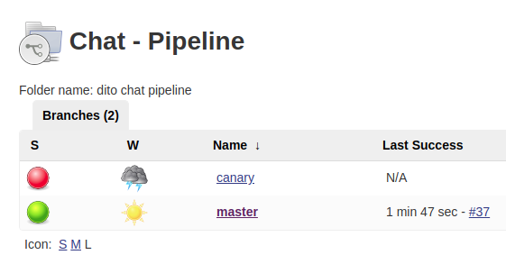
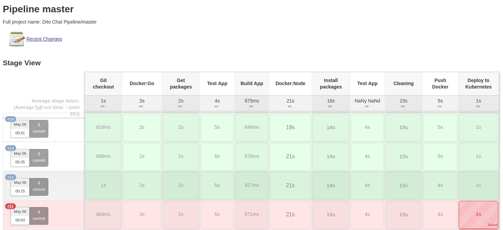

# Dito Chat Pipeline to kubernetes

The technologies used are:
 - Google Cloud,
 - Terraform,
 - Bash script,
 - Docker,
 - Kubernetes,
 - Helm,
 - Jenkins,
 - Canary release strategy

Google Cloud
------------
The Google Cloud Platform was the choice for the test environment, because beyond another factors I think it's more simple to use and the instances startup is more faster.

Terraform and Bash
------------------
Terraform + Bash scripts were used to provisione Google Cloud instances. These instances when finish the startup, are already ready to use, with Docker and Kubernetes installed.
Inside these instances we have to run some more scripts to: A) initial cluster configuration, B) Helm installation, C) pod jenkins creation (using Helm) and D) app environment configuration (namespace and the production / canary deployments).

Docker
------
The Docker we've utilized to "containerize" the apps (frontend, backend and redis), is the master in the category.

Kubernetes
----------
The kubernetes is, no doubt, the best container orquestrator nowadays, and also it has an advantage: it is open source.

Helm
----
Helm is a kind of kubernetes package manager and makes easy to install a lot of things inside kubernetes.

Jenkins
-------
Jenkins is the second CI/CD tool most used, it has some disadvantages comparing to first place, as the need of a host to be installed (or container), but its big advantage is, it's open source.

How it works
==============
We have 2 main branches in this repository: the main and the canary. We also have a Jenkinsfile in the root of repository, in each branch.

In kubernetes, we have 2 deployments spaces in the production namespace: production and canary.

In Jenkins, we created a Multi branch pipeline, that look up for changes on the repository each 2 minutes.
Any change (git push) will trigger a pipeline process, whose flow is conducted by the Jenkinsfile.

When the changes are made in canary branch, the delivery will be made in the canary deployment space of kubernetes. When the changes go to the main branch, the pipeline delivers straight to production deployment space of kubernetes.

The canary / production deployment strategy is more used when the tests process isn't much well defined. The production release is delivered first in the canary deployment space that receives a percentual of the real app access traffic (for a subset of users). After verify that app is 100% functional and no problems, the delivery is made in the real production deployment space.

# Creating the kubernetes environment

To replicate the environment you'll need follow the below steps, after clone this repo:

Requirements
------------

 - Install Terraform -> https://www.terraform.io/downloads.html
 - Install Google Cloud SDK (Optional) -> https://cloud.google.com/sdk/install

Variables to provisioning
-------------------------

In the terraform/variables.tf file, you have to change some variables values:

 - gcp_project -> Your Google Cloud project. Ex: my-gcp-project
 - credentials -> The path to your json credential file. EX: /path/to/my/credentials.json"
 - pub_key -> The path to your SSH public key file. Ex: /path/to/my/public-key.pub
 - priv_key -> The path to your SSH private key file. Ex: /path/to/my/private-key"

The credentials json file can be got only when it is created. If you already have a Google Cloud account, this file will be in some folder in your workstation.

If you installed the GCloud SDK you can get a public/private key pair acessing a Google cloud instance with it (gcloud compute ssh GCP_INSTANCE_NAME --zone=YOUR_INSTANCE_ZONE). If not, you'll have to create manually (If you don't have one yet) and send the public key each of your instance.

Provisioning the instances
--------------------------

This approach create 2 instances to be part of the kubernetes cluster.
Both are n1-standard-2, that have 2 vCPUs and 7.5 GB of RAM. The kubernetes doesn't start the cluster in a machine with less of 2 vCPUs / cores.
If you wish enlarge the instances number in the cluster, edit the terraform/kube-cluster-node.tf file and change the count variable.

Inside the terraform dir, run:

 - terraform init -> to download the Google cloud plugin
 - terraform plan -> if you want see the instances info
 - terraform apply -auto-approve -> to start up the provisioning, without interaction

When provisioning finish you can connect in the instances by SSH, in one of this ways:

 - gcloud compute ssh ubuntu@INSTANCE_NAME --zone=YOUR_INSTANCE_ZONE --ssh-key-file=/path/to/your/private-key/file
 - ssh ubuntu@INSTANCE_EXTERNAL_IP -i /path/to/your/private-key/file (Your public key have to exist in the instances)
 - in Google Cloud web console, access Compute Engine -> VM instances. Then click in the SSH button.
